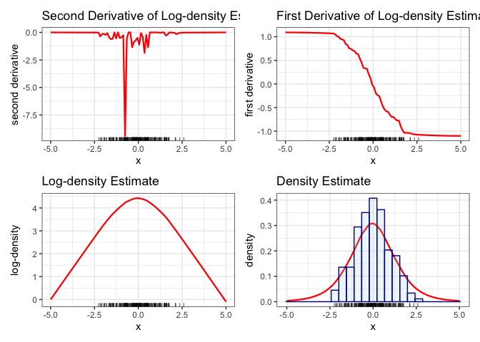
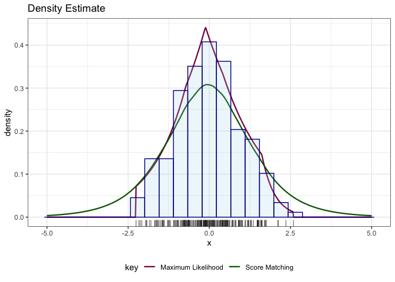

<!-- README.md is generated from README.Rmd. Please edit that file -->

# Log-Concave Density Estimation Using the Score Matching Loss Function

`LogConcaveDESM` is an package to compute and visualize the (penalized)
log-concave score matching density estimate. It also contains functions
to plot the first and second derivatives of the log-density estimate.
Furthermore, functions to compute various distances between two
probability distributions are provided to assess the quality of the
density estimate.

## Installation

The development version of the `LogConcaveDESM` can be installed from
the GitHub using `devtools`:

``` r
# install.packages("devtools")
# devtools::install_github("zhoucx1119/LogConcaveDESM")
```

## Load the Package

``` r
library(LogConcaveDESM, warn.conflicts = FALSE)
library(patchwork)
library(ggplot2)
```

## Computing and Visualizing Unpenalized Log-concave Score Matching Density Estimate over a Bounded Domain

We show how to use functions in `LogConcaveDESM` to compute and
visualize the log-concave score matching density estimate over a bounded
domain.

We first simulate data from a truncated normal distribution over the
interval \[−5,5\].

``` r
set.seed(2021)
N <- 200
parent_mean <- 0
parent_sd <- 1
domain <- c(-5, 5)
t_normal <- truncated_normal(parent_mean, parent_sd, domain)
data <- t_normal$sampling(N)
```

We plot the histogram of the data below.

``` r
binwidth <- 2 * stats::IQR(data) / N ** (1/3)
ggplot() + geom_histogram(
  data = data.frame(x = data), 
  aes(x = x, y = ..density..), 
  binwidth = binwidth,
            color = "darkblue",
            fill = "lightblue") + 
  coord_cartesian(xlim = domain, ylim = c(-0.01, 0.5)) + 
  theme_bw()
```

<!-- -->

We assume that the second derivative of the logarithm of the log-concave
score matching density estimate is a piecewise linear function with
knots at the data points. With no penalty, the resulting optimal second
derivative values at data points can be computed as below:

``` r
result <- lcd_scorematching(
  data = data, 
  domain = domain, 
  penalty_param = 0, 
  verbose = TRUE
)
#> -----------------------------------------------------------------
#>            OSQP v0.6.0  -  Operator Splitting QP Solver
#>               (c) Bartolomeo Stellato,  Goran Banjac
#>         University of Oxford  -  Stanford University 2019
#> -----------------------------------------------------------------
#> problem:  variables n = 202, constraints m = 203
#>           nnz(P) + nnz(A) = 20504
#> settings: linear system solver = qdldl,
#>           eps_abs = 1.0e-05, eps_rel = 1.0e-05,
#>           eps_prim_inf = 1.0e-04, eps_dual_inf = 1.0e-04,
#>           rho = 1.00e-01 (adaptive),
#>           sigma = 1.00e-06, alpha = 1.60, max_iter = 10000
#>           check_termination: on (interval 25),
#>           scaling: on, scaled_termination: off
#>           warm start: on, polish: on, time_limit: off
#> 
#> iter   objective    pri res    dua res    rho        time
#>    1  -4.3429e+00   1.35e+01   4.63e-03   1.00e-01   2.80e-03s
#>  200  -6.7500e+01   2.79e+00   1.88e-03   1.98e-02   1.09e-02s
#>  400  -7.1064e+01   4.32e+00   4.59e-04   3.81e-03   1.88e-02s
#>  600  -6.5517e+01   1.60e+00   1.22e-04   3.81e-03   2.60e-02s
#>  800  -6.7135e+01   4.42e-01   3.10e-05   3.81e-03   3.31e-02s
#> 1000  -6.6824e+01   1.01e-01   6.51e-06   3.81e-03   3.98e-02s
#> plsh  -6.6874e+01   4.27e-10   3.14e-09   --------   4.14e-02s
#> 
#> status:               solved
#> solution polish:      successful
#> number of iterations: 1000
#> optimal objective:    -66.8737
#> run time:             4.14e-02s
#> optimal rho estimate: 1.93e-03
#> The status of solving the constrained quadratic optimization problem is: optimal.
```

Then, the second derivative of the logarithm of the log-concave score
matching density estimate at arbitrary points can be computed using the
`evaluate_logdensity_deriv2` function, and can be visualized using the
`plot_logdensity_deriv2` function.

``` r
logden_deriv2_vals <- evaluate_logdensity_deriv2(
  scorematching_logconcave = result, 
  newx = seq(domain[1], domain[2], length.out = 11)
)
logden_deriv2_vals
#>    newx_sorted logderiv2_vals
#> 1           -5  -1.488096e-23
#> 2           -4  -7.214839e+01
#> 3           -3  -1.442968e+02
#> 4           -2   2.368584e-13
#> 5           -1   2.606746e-12
#> 6            0  -1.251196e-10
#> 7            1   1.092312e-10
#> 8            2  -5.711015e-11
#> 9            3  -7.400681e-12
#> 10           4  -3.700341e-12
#> 11           5   0.000000e+00

plot_deriv2 <- plot_logdensity_deriv2(
  scorematching_logconcave = result, 
  plot_domain = domain, 
  plot_points_cnt = 500)
plot_deriv2
```

<!-- -->

Subsequently, the first derivative of the logarithm of the log-concave
score matching density estimate at arbitrary points can be computed
using the `evaluate_logdensity_deriv1` function, and can be visualized
using the `plot_logdensity_deriv1` function.

``` r
logden_deriv1_vals <- evaluate_logdensity_deriv1(
  scorematching_logconcave = result, 
  newx = seq(domain[1], domain[2], length.out = 11)
)
logden_deriv1_vals
#>    newx_sorted logderiv1_vals
#> 1           -5     294.125904
#> 2           -4     258.051708
#> 3           -3     149.829119
#> 4           -2      13.667716
#> 5           -1       9.167263
#> 6            0       5.598630
#> 7            1     -13.979790
#> 8            2     -33.035110
#> 9            3     -33.035110
#> 10           4     -33.035110
#> 11           5     -33.035110

plot_deriv1 <- plot_logdensity_deriv1(
  scorematching_logconcave = result, 
  plot_domain = domain, 
  plot_points_cnt = 500)
plot_deriv1
```

<!-- -->

Then, the (un-normalized) log-density estimate at arbitrary point can be
computed using the `evaluate_logdensity` function, and can be visualized
using the `plot_logdensity` function.

``` r
logden_vals <- evaluate_logdensity(
  scorematching_logconcave = result, 
  newx = seq(domain[1], domain[2], length.out = 11)
)
logden_vals
#>    newx_sorted logdensity_vals
#> 1           -5          0.0000
#> 2           -4        282.1012
#> 3           -3        492.0540
#> 4           -2        562.3994
#> 5           -1        574.0298
#> 6            0        580.8876
#> 7            1        575.0199
#> 8            2        553.7940
#> 9            3        520.7589
#> 10           4        487.7238
#> 11           5        454.6887

plot_logden <- plot_logdensity(
  scorematching_logconcave = result, 
  plot_domain = domain, 
  plot_points_cnt = 500)
plot_logden
```

<!-- -->

Finally, to evaluate and visualize the density estimate itself, we use
`evaluate_density` and `plot_density` functions, respectively.

``` r
den_vals <- evaluate_density(
  scorematching_logconcave = result, 
  newx = seq(domain[1], domain[2], length.out = 11)
)
#> [1] 1.748594e+252
den_vals
#>    newx_sorted  density_vals
#> 1           -5 5.718881e-253
#> 2           -4 1.871947e-130
#> 3           -3  2.842021e-39
#> 4           -2  1.009840e-08
#> 5           -1  1.135730e-03
#> 6            0  1.080366e+00
#> 7            1  3.056907e-03
#> 8            2  1.849261e-12
#> 9            3  8.318257e-27
#> 10           4  3.741679e-41
#> 11           5  1.683064e-55

plot_den <- plot_density(
  scorematching_logconcave = result,
  plot_domain = domain,
  plot_points_cnt = 500, 
  plot_hist = TRUE
  )
#> [1] 1.748594e+252
plot_den
```

<!-- -->

## Computing and Visualizing Penalized Log-concave Score Matching Density Estimate over a Bounded Domain

As we can see above, the un-penalized log-concave score matching density
estimate is too concentrated at the place where data are abundant. To
remedy this, we consider penalized log-concave score matching density
estimate, where the optimal penalty parameter can be chosen using the
`cv_optimal_density_estimate` function.

``` r
lambda_cand <- exp(seq(-5, 1, by = 0.5))
opt_den <- cv_optimal_density_estimate(
  data = data, 
  domain = domain, 
  penalty_param_candidates = lambda_cand, 
  fold_number = 5
)
#> Penalty parameter value: 0.00673794699908547
#> The status of solving the constrained quadratic optimization problem is: optimal. 
#> The status of solving the constrained quadratic optimization problem is: optimal. 
#> The status of solving the constrained quadratic optimization problem is: optimal. 
#> The status of solving the constrained quadratic optimization problem is: optimal. 
#> The status of solving the constrained quadratic optimization problem is: optimal.
#> Penalty parameter value: 0.0111089965382423
#> The status of solving the constrained quadratic optimization problem is: optimal. 
#> The status of solving the constrained quadratic optimization problem is: optimal. 
#> The status of solving the constrained quadratic optimization problem is: optimal. 
#> The status of solving the constrained quadratic optimization problem is: optimal. 
#> The status of solving the constrained quadratic optimization problem is: optimal.
#> Penalty parameter value: 0.0183156388887342
#> The status of solving the constrained quadratic optimization problem is: optimal. 
#> The status of solving the constrained quadratic optimization problem is: optimal. 
#> The status of solving the constrained quadratic optimization problem is: optimal. 
#> The status of solving the constrained quadratic optimization problem is: optimal. 
#> The status of solving the constrained quadratic optimization problem is: optimal.
#> Penalty parameter value: 0.0301973834223185
#> The status of solving the constrained quadratic optimization problem is: optimal. 
#> The status of solving the constrained quadratic optimization problem is: optimal. 
#> The status of solving the constrained quadratic optimization problem is: optimal. 
#> The status of solving the constrained quadratic optimization problem is: optimal. 
#> The status of solving the constrained quadratic optimization problem is: optimal.
#> Penalty parameter value: 0.0497870683678639
#> The status of solving the constrained quadratic optimization problem is: optimal. 
#> The status of solving the constrained quadratic optimization problem is: optimal. 
#> The status of solving the constrained quadratic optimization problem is: optimal. 
#> The status of solving the constrained quadratic optimization problem is: optimal. 
#> The status of solving the constrained quadratic optimization problem is: optimal.
#> Penalty parameter value: 0.0820849986238988
#> The status of solving the constrained quadratic optimization problem is: optimal. 
#> The status of solving the constrained quadratic optimization problem is: optimal. 
#> The status of solving the constrained quadratic optimization problem is: optimal. 
#> The status of solving the constrained quadratic optimization problem is: optimal. 
#> The status of solving the constrained quadratic optimization problem is: optimal.
#> Penalty parameter value: 0.135335283236613
#> The status of solving the constrained quadratic optimization problem is: optimal. 
#> The status of solving the constrained quadratic optimization problem is: optimal. 
#> The status of solving the constrained quadratic optimization problem is: optimal. 
#> The status of solving the constrained quadratic optimization problem is: optimal. 
#> The status of solving the constrained quadratic optimization problem is: optimal.
#> Penalty parameter value: 0.22313016014843
#> The status of solving the constrained quadratic optimization problem is: optimal. 
#> The status of solving the constrained quadratic optimization problem is: optimal. 
#> The status of solving the constrained quadratic optimization problem is: optimal. 
#> The status of solving the constrained quadratic optimization problem is: optimal. 
#> The status of solving the constrained quadratic optimization problem is: optimal.
#> Penalty parameter value: 0.367879441171442
#> The status of solving the constrained quadratic optimization problem is: optimal. 
#> The status of solving the constrained quadratic optimization problem is: optimal. 
#> The status of solving the constrained quadratic optimization problem is: optimal. 
#> The status of solving the constrained quadratic optimization problem is: optimal. 
#> The status of solving the constrained quadratic optimization problem is: optimal.
#> Penalty parameter value: 0.606530659712633
#> The status of solving the constrained quadratic optimization problem is: optimal. 
#> The status of solving the constrained quadratic optimization problem is: optimal. 
#> The status of solving the constrained quadratic optimization problem is: optimal. 
#> The status of solving the constrained quadratic optimization problem is: optimal. 
#> The status of solving the constrained quadratic optimization problem is: optimal.
#> Penalty parameter value: 1
#> The status of solving the constrained quadratic optimization problem is: optimal. 
#> The status of solving the constrained quadratic optimization problem is: optimal. 
#> The status of solving the constrained quadratic optimization problem is: optimal. 
#> The status of solving the constrained quadratic optimization problem is: optimal. 
#> The status of solving the constrained quadratic optimization problem is: optimal.
#> Penalty parameter value: 1.64872127070013
#> The status of solving the constrained quadratic optimization problem is: optimal. 
#> The status of solving the constrained quadratic optimization problem is: optimal. 
#> The status of solving the constrained quadratic optimization problem is: optimal. 
#> The status of solving the constrained quadratic optimization problem is: optimal. 
#> The status of solving the constrained quadratic optimization problem is: optimal.
#> Penalty parameter value: 2.71828182845905
#> The status of solving the constrained quadratic optimization problem is: optimal. 
#> The status of solving the constrained quadratic optimization problem is: optimal. 
#> The status of solving the constrained quadratic optimization problem is: optimal. 
#> The status of solving the constrained quadratic optimization problem is: optimal. 
#> The status of solving the constrained quadratic optimization problem is: optimal.
#> c(0.00673794699908547, 0.0111089965382423, 0.0183156388887342, 0.0301973834223185, 0.0497870683678639, 0.0820849986238988, 0.135335283236613, 0.22313016014843, 0.367879441171442, 0.606530659712633, 1, 1.64872127070013, 2.71828182845905)c(10.4393949720615, 6.56398796412593, 3.61068316988729, 1.39939440602571, 0.119217692029153, -0.659934761658924, -0.99454741136814, -1.09873663169563, -1.04696779545914, -0.904513505116862, -0.708340762882839, -0.512101693621595, -0.348601108001249)
#> Optimal penality parameter is 0.22313016014843.
#> The status of solving the constrained quadratic optimization problem is: optimal.
```

The second and first derivatives of the logarithm of the optimal density
estimate, the logarithm of the un-normalized optimal density estimate,
and the optimal density estimate itself are plotted as below.

``` r
plot_ld2 <- plot_logdensity_deriv2(
  scorematching_logconcave = opt_den,
  plot_domain = domain
  )

plot_ld1 <- plot_logdensity_deriv1(
  scorematching_logconcave = opt_den,
  plot_domain = domain
  )

plot_ld <- plot_logdensity(
  scorematching_logconcave = opt_den,
  plot_domain = domain
  )

plot_den <- plot_density(
  scorematching_logconcave = opt_den,
  plot_domain = domain,
  plot_points_cnt = 500, 
  plot_hist = TRUE
  )
#> [1] 271.2789

plot_ld2 + plot_ld1 + plot_ld + plot_den
```

<!-- -->

We can also use the function \`\` to view the log-concave maximum
likelihood and score matching density estimates together with the
histogram.

``` r
plot_mle_scorematching(
  scorematching_logconcave = opt_den, 
  plot_domain = domain, 
  plot_points_cnt = 500, 
  plot_hist = TRUE) 
#> [1] 271.2789
```

<!-- -->

We could assess the quality of this density estimate using various
metrics between two probability distributions, for example, the
Kullback-Leibler divergence, the Hyvarinen divergence, the *L*1
distance, and the Hellinger distance.

``` r
kl <- kl_div(
  true_density = t_normal, 
  density_estimate = opt_den) 
#> [1] 271.2789
#> [1] 271.2789
#> [1] 271.2789
#> [1] 271.2789
#> [1] 271.2789
#> [1] 271.2789
#> [1] 271.2789
#> [1] 271.2789
#> [1] 271.2789
#> [1] 271.2789
#> [1] 271.2789
#> [1] 271.2789
#> [1] 271.2789
#> [1] 271.2789
#> [1] 271.2789
#> [1] 271.2789
#> [1] 271.2789
#> [1] 271.2789
#> [1] 271.2789
#> [1] 271.2789

hyva <- hyvarinen_div(
  true_density = t_normal, 
  density_estimate = opt_den) 

l1 <- L1_dist(
  true_density = t_normal, 
  density_estimate = opt_den) 
#> [1] 271.2789
#> [1] 271.2789
#> [1] 271.2789
#> [1] 271.2789

he <- hellinger_dist(
  true_density = t_normal, 
  density_estimate = opt_den) 
#> [1] 271.2789
#> [1] 271.2789
#> [1] 271.2789
#> [1] 271.2789

metric_table <- cbind(
  Metrics = c("Kullback-Leibler Divergence", "Hyvarinen divergence", 
              "L1 Distance", "Hellinger Distance"), 
  Values = round(c(kl, hyva, l1, he), 5)
)

knitr::kable(metric_table)
```

| Metrics                     | Values  |
|:----------------------------|:--------|
| Kullback-Leibler Divergence | 0.09961 |
| Hyvarinen divergence        | 0.10237 |
| L1 Distance                 | 0.29509 |
| Hellinger Distance          | 0.1774  |

## Computing and Visualizing Penalized Log-concave Score Matching Density Estimate over Other Types of Domain

Besides the bounded domain demonstrated above, `LogConcaveDESM` can also
compute and visualize log-concave score matching density estimate over
other types of domain, including the entire real line, an interval of
the form (−∞,*b*) for some *b* \< ∞, and an interval of the form (*a*,∞)
for some *a* \>  − ∞. Functions used are the same as those used in the
bounded interval case. Demonstrations are omitted.
